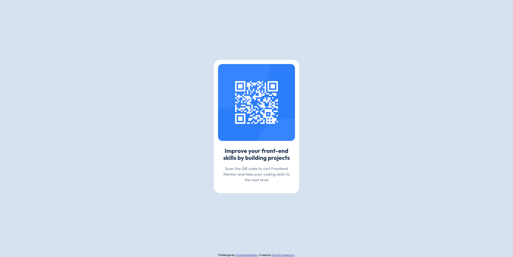

# Frontend Mentor - QR code component solution

This is a solution to the [QR code component challenge on Frontend Mentor](https://www.frontendmentor.io/challenges/qr-code-component-iux_sIO_H). Frontend Mentor challenges help you improve your coding skills by building realistic projects. 

## Table of contents

- [Overview](#overview)
  - [Screenshot](#screenshot)
  - [Links](#links)
- [My process](#my-process)
  - [Built with](#built-with)
  - [Continued development](#continued-development)
  - [Useful resources](#useful-resources)
- [Author](#author)

## Overview

### Screenshot

### Links

- Solution URL: [Solution URL](https://github.com/Sseik/qr-code-component-main/)
- Live Site URL: [Live site URL](https://sseik.github.io/qr-code-component-main/)

## My process

### Built with

- Semantic HTML5 markup
- CSS custom properties
- Flexbox

### Continued development

After doing this project I decided to practice creating web pages looking as close as possible to provided figma designs.

### Useful resources

- [W3Schools](https://www.w3schools.com/) - This helped me learn basics of JS, HTML and CSS.
- [TOP](https://www.theodinproject.com/) - This amazing resource helped me refresh my knowledge of HTML, CSS and JS and still helps me strengthen it with the new knowledge and practice.

## Author

- LinkedIn - [Dmytro Hapchyn](https://www.linkedin.com/in/dmytro-hapchyn-974b5b303/)
- Frontend Mentor - [@yourusername](https://www.frontendmentor.io/profile/yourusername)
